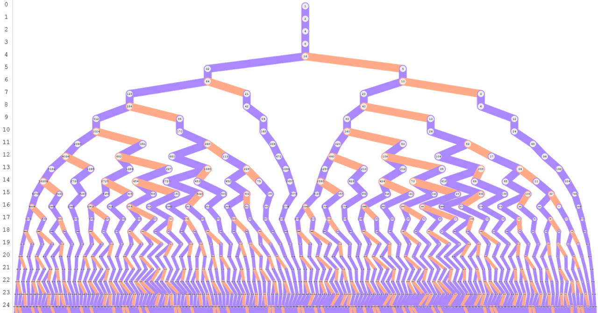

# Collatz Conjecture: A Mathematical Enigma

The Collatz Conjecture, also known as the "3n + 1 problem," is a simple yet deeply puzzling problem in mathematics. Despite its straightforward definition, the conjecture has eluded proof for over 80 years, and it remains one of the most intriguing unsolved problems in mathematics.
##

## Mathematical Definition

The Collatz Conjecture applies to any positive integer \( n \) and is defined as follows:

1. **If \( n \) is even**, divide it by 2:  
   \[
   n &rarr; n/2
   \]
   
2. **If \( n \) is odd**, multiply it by 3 and add 1:  
   \[
   n &rarr; 3n + 1
   \]

The conjecture states that, no matter which positive integer \( n \) you start with, repeatedly applying these operations will eventually lead you to the number 1.

### The Collatz Sequence

Given an integer \( n \), applying the above rules generates a sequence of numbers called the **Collatz sequence**. For example:

- Starting with \( n = 6 \):  
  6 &rarr; 3 &rarr; 10 &rarr; 5 &rarr; 16 &rarr; 8 &rarr; 4 &rarr; 2 &rarr; 1

- Starting with \( n = 19 \):  
  19 &rarr; 58 &rarr; 29 &rarr; 88 &rarr; 44 &rarr; 22 &rarr; 11 &rarr; 34 &rarr; 17 &rarr; 52 &rarr; 26 &rarr; 13 &rarr; 40 &rarr; 20 &rarr; 10 &rarr; 5 &rarr; 16 &rarr; 8 &rarr; 4 &rarr; 2 &rarr; 1

The conjecture posits that every initial value \( n \) eventually produces a sequence that reaches 1.

### Graphical Representation

The Collatz sequence can be visualized graphically, where each step in the sequence represents a node connected by an edge to the next step. The resulting graph reveals a tree-like structure with 1 at the root, and every other number eventually connected to it.

## Understanding the Conjecture

### Mathematical Exploration

Mathematicians have explored the Collatz Conjecture in various ways, including:

- **Computational Verification**: The conjecture has been tested for large values of \( n \) (up to \( 2^{68} \) as of recent efforts) using computers, and no counterexamples have been found. Despite this, no general proof exists.
  
- **Cycle Analysis**: The only cycle known for the sequence is the trivial cycle involving the numbers \( 1 \rightarrow 4 \rightarrow 2 \rightarrow 1 \). If any other cycle exists, it would disprove the conjecture.
  
- **Stopping Time**: The stopping time or total stopping time for a number \( n \) is the number of steps required for the sequence to reach 1. Researchers have studied patterns in stopping times to understand the behavior of the sequence.

### External References

For those interested in further exploration of the Collatz Conjecture, the following resources provide in-depth information:

- **Paul Erdős' Conjecture**: Erdős famously said, "Mathematics is not yet ready for such problems," reflecting the difficulty of proving the conjecture.
- **Jeffrey C. Lagarias' Survey**: "The 3x + 1 Problem and Its Generalizations" is a comprehensive survey that delves into the conjecture's variations and generalizations.
- **Terence Tao's Work**: The Fields Medalist has made significant contributions to the study of the Collatz Conjecture, particularly in understanding the distribution of stopping times.

### Uses and Applications

While the Collatz Conjecture might appear purely theoretical, it has connections to various areas of mathematics and computer science, including:

- **Number Theory**: The conjecture is a classic problem in number theory, exploring properties of integers and their behaviors under specific operations.
  
- **Complex Systems**: The iterative process of the conjecture is akin to dynamical systems, where simple rules can lead to complex behavior, relevant in studying chaotic systems.
  
- **Algorithm Design**: The conjecture's structure provides a case study for recursive algorithms and iterative processes, contributing to the development of algorithms that deal with sequences and series.

## Issues and Challenges

The primary challenge with the Collatz Conjecture is the lack of a proof. The conjecture's simplicity belies its difficulty, as mathematicians have yet to find a way to generalize the problem or approach it using existing mathematical techniques. Despite extensive computational evidence supporting the conjecture, proving it remains one of the most significant open problems in mathematics.

### The Unsolved Mystery

The Collatz Conjecture continues to intrigue both professional mathematicians and enthusiasts. Its resolution, whether through proof or disproof, would be a monumental achievement, offering deeper insights into the nature of numbers and mathematical processes.

---

This repository serves as a mathematical exploration of the Collatz Conjecture, offering insights into its definition, implications, and the ongoing efforts to solve this enduring mystery.
